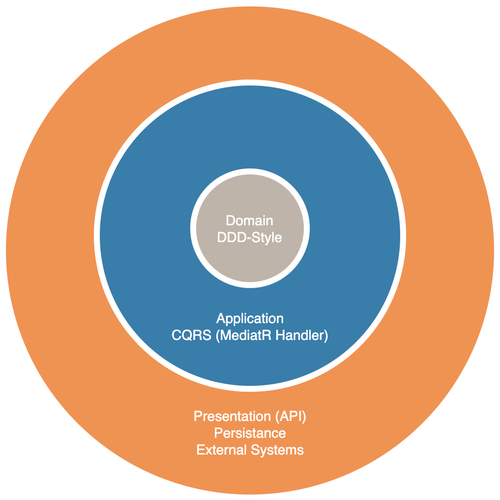

# C# Web-Api template in DDD-Style

Template for C# REST-API project.

[](https://app.fossa.com/projects/git%2Bgithub.com%2FFJuette%2Ftusk-ms?ref=badge_shield)

## Technologies

* .net9
* EF Core 9
* FluentValidation and default validation disabled
* AutoMapper
* MediatR to support CQRS style
* Swashbuckle Swagger with xml documention
* Serilog with default console output
* Unit and integration tests with XUnit
* DDD-Style model classes and Onion-Architecture
* C# 13 features enabled with nullable compiler checks

Mainly inspired by <https://github.com/JasonGT/NorthwindTraders> and Vladimir Khorikov <https://github.com/vkhorikov>

## Usage

Nuget Package: <https://www.nuget.org/packages/FJuette.Template.WebApi/>

```bash
# Install the template from nuget
dotnet new --install FJuette.Template.WebApi

# Create a new project from the template
dotnet new ddd-webapi -n Magnus

# Remove the template
dotnet new -u FJuette.Template.WebApi
```

## Template Architecture

Onion Style:


## License

This project is licensed under the Apache License - see the [LICENSE](LICENSE) file for details.

[](https://app.fossa.com/projects/git%2Bgithub.com%2FFJuette%2Ftusk-ms?ref=badge_large)

## References

* <https://medium.com/agilix/entity-framework-core-enums-ee0f8f4063f2>
* <https://code-maze.com/migrations-and-seed-data-efcore/>
* <https://dev.to/integerman/eliminating-nulls-in-c-with-functional-programming-iaa>
* <https://medium.com/swlh/safer-code-with-c-8-non-null-reference-types-cd5241e5714>
* <https://medium.com/swlh/getting-lazy-in-c-ccc5fd59cb7c>
* <https://herbertograca.com/2017/10/19/from-cqs-to-cqrs/>
* <http://docs.automapper.org/en/stable/Queryable-Extensions.html>
* <https://herbertograca.com/2017/11/16/explicit-architecture-01-ddd-hexagonal-onion-clean-cqrs-how-i-put-it-all-together/>
* <https://docs.microsoft.com/en-us/ef/core/testing/testing-sample>
* <https://github.com/MoienTajik/MediatrTutorial/tree/master/MediatrTutorial>
* <https://github.com/jbogard/MediatR/wiki/Behaviors>
* <https://r.bluethl.net/how-to-design-better-apis>
